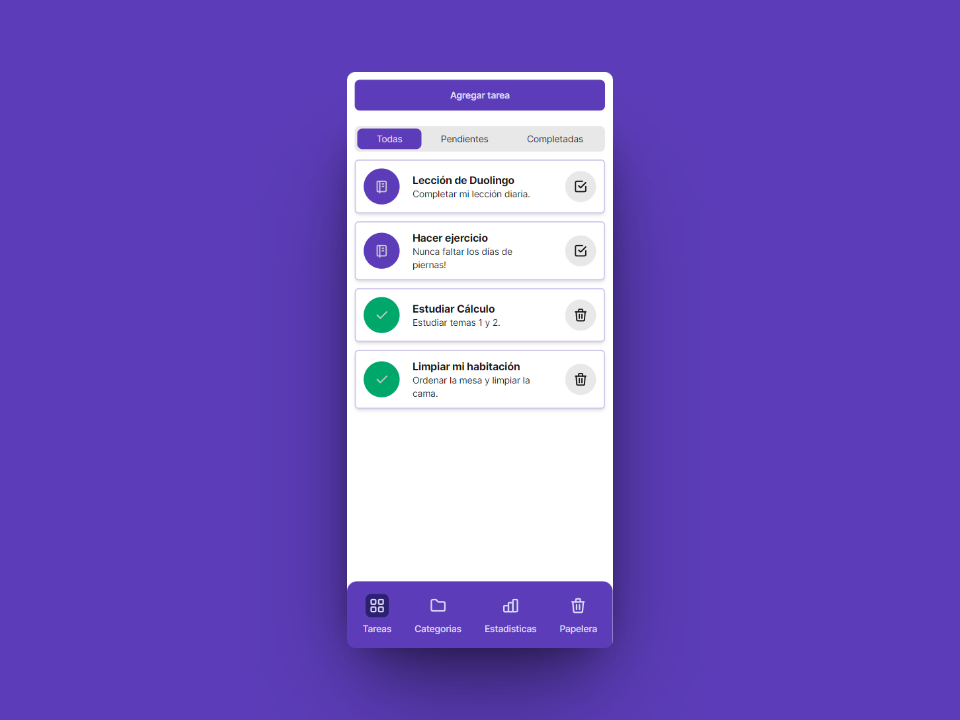

# Tareinga

Tareinga es una webapp sencilla y liviana para organizar tus tareas y todo lo que debes hacer en un sólo lugar.

**Actualmente se encuentra en desarrollo.**

## Características

- **Almacenamiento local:** ¡Ningún dato en la nube! Toda la información se queda en tu dispositivo.
- **Progressive WebApp (PWA):** Instala una aplicación movil desde tu navegador totalmente compatible con tu sistema operativo. *(ToDo)*

## Tecnologías

- Tailwind, NextJS, Dexie.js.

## Diseño
- [Ver Figma](https://www.figma.com/file/7GXoEMip1hsIOoMEqIk3jg/Tareinga?type=design&node-id=0%3A1&mode=design&t=6l0CcrvItd2XrW5k-1)